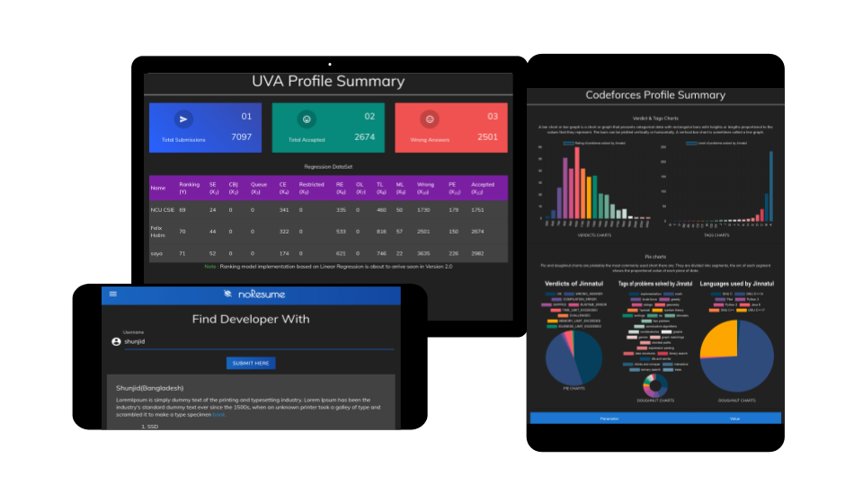

# NoResume

Today, what is happening around the world in the tradition of ‘Job application’ is that job applicants are submitting CV (Curriculum Vitae) to the companies which are offering some sort of job post for vacancy. This tradition is okay when the company is only concerned about Grades only. But in Engineering fields this tradition has no beneficial concern. 
Because companies want to hire Engineers who are skilled in their fields. Especially in the field of  Computer Science & Engineering or Software Engineering ‘Skill/Expertise” of an Engineer is preferred more than their grades. So, to submitting a traditional resume isn’t beneficial to find out the quality programmers/developers. This project has come with some innovative ideas to solve this problem.

## Objectives

Main objectives of implementing this project are listed below to better understand what are the goals -

* Generating real time working profile of Software Engineers based on their works they have done on different platforms
* Comparing profile of Software Engineers with others
* Working with Application programming interface (API) 
* Authenticated and Verified resume resources
* Finding Quality Software Engineers
* Prediction of what technologies are going to be popular in the near future

## Target Users

Though this is going to be a general purpose service and so any one can use it but mainly I have targeted some users like :

* CSE/Software Engineering Graduates
* ACM ICPC Problem solvers
* Open source developers
* IT Companies who are hiring

## Functional Features
	
+ **Private Area**
    * Creating personal account for everyone
    * Signing in
    * Initiating Short Biography, Job Availability, Current Location
    * Initiating GitHub, Codeforces, UVA online Judge username/handlers
    * Privacy for different platforms

+ **Public Area**
    * Effort Summary base rating of Codeforces, GitHub & UVA
    * Chart representation of what the programmer has worked on those 3 platforms like:
        - Pie & Donough Chart
        - Bar Chart
        - Line & Animation
    * Comparison with other developers
    * Prediction of next popular Framework on a country or worldwide to better understand for newly enrolled CSE/SWE students or who are interested in this context to help them understand what language or framework should work with.
 

## Non-Functional Features

+ **Material User Interface**
    * Realistic visual cues inspired by ‘Paper and Ink’ design
    * Elements live in defined spaces with a clear hierarchy
    * Simple but smooth component transition with Charts
    
+ **Performance & Usability**
    * Though the main context of this application is dependent on the API provider performance, It will be loading user data as fast as possible after API responses
    * Application will be much more user friendly that any new user can easily understand what to do and where to go

+ **Security**
    * Security will be another major concern after design from the very ground up
    * User authentication,Front-end User Input Validation, Role based authorization, Audit & Logging, Exception handling & Cryptography will be concerned in the context of security for the application

## Resources 
* Framework: Dotnet Core 2.2
* CSS Framework : Materialize CSS 1.0.0
* Javascript Frameworks/Libraries
   * jQuery 3.4.1
   * ChartJS
   * Froala text editor
* Object Relational Mapping: Entity Framework Core 2.2.0
* External NuGet Packages
   * Microsoft.AspNetCore.Identity.EntityFrameworkCore --version 2.2.0
   * Microsoft.AspNetCore.Identity --version 2.2.0
   * Microsoft.EntityFrameworkCore.Design --version 2.2.6
   * Microsoft.EntityFrameworkCore.Sqlite --version 2.2.6
   * Microsoft.EntityFrameworkCore.SqlServer --version 2.2.6
   * Microsoft.VisualStudio.Web.CodeGeneration.Design --version 2.2.3
   * Microsoft.AspNetCore.StaticFiles --version 2.2.0
